# GTFS schema

<!-- GENERATED from schema/gtfs.yaml by scripts/build_schema_docs.py. Edit the schema, not this file. -->

The GTFS schema used in this project is based on the [official GTFS Schedule Reference](https://gtfs.org/documentation/schedule/reference/).
This document and the schema files included in this project are **not intended to be the source of truth for the GTFS specification**.
They are maintained to support this project in formatting and validating GTFS datasets.
This documentation describes the 32 files defined by GTFS and the 223 fields they contain, including each field's data type, whether it is required, and any references to fields in other files.
The machine-readable version is [`gtfs-schema.json`](../src/gtfs_garage/data/gtfs-schema.json), which is included in the package. Both this documentation and the JSON schema are generated from [`schema/gtfs.yaml`](../schema/gtfs.yaml).

## How the files relate

```mermaid
erDiagram
    agency {
        ID agency_id PK
    }
    areas {
        ID area_id PK
    }
    attributions {
        ID attribution_id PK
    }
    booking_rules {
        ID booking_rule_id PK
    }
    calendar {
        ID service_id PK
    }
    calendar_dates {
        ID service_id PK
        DATE date PK
    }
    fare_attributes {
        ID fare_id PK
    }
    fare_leg_join_rules
    fare_leg_rules {
        ID network_id PK
        ID from_area_id PK
        ID to_area_id PK
        ID from_timeframe_group_id PK
        ID to_timeframe_group_id PK
        ID fare_product_id PK
    }
    fare_media {
        ID fare_media_id PK
    }
    fare_products {
        ID fare_product_id PK
        ID fare_media_id PK
        ID rider_category_id PK
    }
    fare_rules {
        ID fare_id PK
        ID route_id PK
        ID origin_id PK
        ID destination_id PK
        ID contains_id PK
    }
    fare_transfer_rules {
        ID from_leg_group_id PK
        ID to_leg_group_id PK
        INTEGER duration_limit PK
        INTEGER transfer_count PK
        ID fare_product_id PK
    }
    feed_info
    frequencies {
        ID trip_id PK
        TIME start_time PK
    }
    levels {
        ID level_id PK
    }
    location_group_stops
    location_groups {
        ID location_group_id PK
    }
    locations {
        ID id PK
    }
    networks {
        ID network_id PK
    }
    pathways {
        ID pathway_id PK
    }
    rider_categories {
        ID rider_category_id PK
    }
    route_networks {
        ID route_id PK
    }
    routes {
        ID route_id PK
    }
    shapes {
        ID shape_id PK
        INTEGER shape_pt_sequence PK
    }
    stop_areas {
        ID area_id PK
        ID stop_id PK
    }
    stop_times {
        ID trip_id PK
        INTEGER stop_sequence PK
    }
    stops {
        ID stop_id PK
    }
    timeframes {
        ID timeframe_group_id PK
        TIME start_time PK
        TIME end_time PK
        TEXT service_id PK
    }
    transfers {
        ID from_stop_id PK
        ID to_stop_id PK
        ID from_trip_id PK
        ID to_trip_id PK
        ID from_route_id PK
        ID to_route_id PK
    }
    translations {
        TEXT table_name PK
        TEXT field_name PK
        LANGUAGE_CODE language PK
        TEXT record_id PK
        TEXT record_sub_id PK
        TEXT field_value PK
    }
    trips {
        ID trip_id PK
    }
    attributions }o--o| agency : "agency_id"
    attributions }o--o| routes : "route_id"
    attributions }o--o| trips : "trip_id"
    calendar_dates }o--|| calendar : "service_id"
    fare_attributes }o--o| agency : "agency_id"
    fare_leg_join_rules }o--o| stops : "from_stop_id"
    fare_leg_join_rules }o--o| stops : "to_stop_id"
    fare_leg_rules }o--o| areas : "from_area_id"
    fare_leg_rules }o--o| areas : "to_area_id"
    fare_leg_rules }o--o| timeframes : "from_timeframe_group_id"
    fare_leg_rules }o--o| timeframes : "to_timeframe_group_id"
    fare_leg_rules }o--|| fare_products : "fare_product_id"
    fare_products }o--o| fare_media : "fare_media_id"
    fare_products }o--o| rider_categories : "rider_category_id"
    fare_rules }o--|| fare_attributes : "fare_id"
    fare_rules }o--o| routes : "route_id"
    fare_rules }o--o| stops : "origin_id"
    fare_rules }o--o| stops : "destination_id"
    fare_rules }o--o| stops : "contains_id"
    fare_transfer_rules }o--o| fare_leg_rules : "from_leg_group_id"
    fare_transfer_rules }o--o| fare_leg_rules : "to_leg_group_id"
    fare_transfer_rules }o--o| fare_products : "fare_product_id"
    frequencies }o--|| trips : "trip_id"
    pathways }o--|| stops : "from_stop_id"
    pathways }o--|| stops : "to_stop_id"
    route_networks }o--|| routes : "route_id"
    route_networks }o--|| networks : "network_id"
    routes }o--o| agency : "agency_id"
    stop_areas }o--|| areas : "area_id"
    stop_areas }o--|| stops : "stop_id"
    stop_times }o--|| trips : "trip_id"
    stop_times }o--o| stops : "stop_id"
    stop_times }o--o| location_groups : "location_group_id"
    stop_times }o--o| locations : "location_id"
    stop_times }o--o| booking_rules : "pickup_booking_rule_id"
    stop_times }o--o| booking_rules : "drop_off_booking_rule_id"
    stops }o--o| stops : "parent_station"
    stops }o--o| levels : "level_id"
    transfers }o--o| stops : "from_stop_id"
    transfers }o--o| stops : "to_stop_id"
    transfers }o--o| trips : "from_trip_id"
    transfers }o--o| trips : "to_trip_id"
    transfers }o--o| routes : "from_route_id"
    transfers }o--o| routes : "to_route_id"
    trips }o--|| routes : "route_id"
    trips }o--|| calendar : "service_id"
    trips }o--o| shapes : "shape_id"
```

Each box is a file, keyed by its primary key. An arrow runs from the file that
holds the reference to the file it points at, labelled with the field carrying
it. A solid end means the reference is required, an open one that it is optional.

## Files

### `agency.txt`

The agency.txt file.

| Field | Type | Required | Notes |
|---|---|---|---|
| `agency_id` | ID | Conditional[^feed] — Required when the feed contains more than one agency. | primary key |
| `agency_name` | TEXT | **Required** |  |
| `agency_url` | URL | **Required** |  |
| `agency_timezone` | TIMEZONE | **Required** |  |
| `agency_lang` | LANGUAGE_CODE | Optional |  |
| `agency_phone` | PHONE_NUMBER | Optional |  |
| `agency_fare_url` | URL | Optional |  |
| `agency_email` | EMAIL | Optional |  |
| `cemv_support` | ENUM | Optional | `0` No Information, `1` Supported, `2` Not Supported |

### `areas.txt`

The areas.txt file.

| Field | Type | Required | Notes |
|---|---|---|---|
| `area_id` | ID | **Required** | primary key |
| `area_name` | TEXT | Optional |  |

### `attributions.txt`

The attributions.txt file.

| Field | Type | Required | Notes |
|---|---|---|---|
| `attribution_id` | ID | Optional | primary key |
| `agency_id` | ID | Optional | → `agency.agency_id` |
| `route_id` | ID | Optional | → `routes.route_id` |
| `trip_id` | ID | Optional | → `trips.trip_id` |
| `organization_name` | TEXT | **Required** |  |
| `is_producer` | ENUM | Optional | `0` Not Assigned, `1` Assigned |
| `is_operator` | ENUM | Optional | `0` Not Assigned, `1` Assigned |
| `is_authority` | ENUM | Optional | `0` Not Assigned, `1` Assigned |
| `attribution_url` | URL | Optional |  |
| `attribution_email` | EMAIL | Optional |  |
| `attribution_phone` | PHONE_NUMBER | Optional |  |

### `booking_rules.txt`

The booking_rules.txt file.

| Field | Type | Required | Notes |
|---|---|---|---|
| `booking_rule_id` | ID | **Required** | primary key |
| `booking_type` | ENUM | **Required** | `0` Realtime, `1` Sameday, `2` Priorday |
| `prior_notice_duration_min` | INTEGER | Conditional — Required for booking_type=1 (same-day booking). Forbidden otherwise. |  |
| `prior_notice_duration_max` | INTEGER | Optional |  |
| `prior_notice_start_day` | INTEGER | Optional |  |
| `prior_notice_start_time` | TIME | Conditional — Required if prior_notice_start_day is defined. Forbidden otherwise. |  |
| `prior_notice_last_day` | INTEGER | Conditional — Required for booking_type=2 (prior-day booking). Forbidden otherwise. |  |
| `prior_notice_last_time` | TIME | Conditional — Required if prior_notice_last_day is defined. Forbidden otherwise. |  |
| `prior_notice_service_id` | TEXT | Optional |  |
| `message` | TEXT | Optional |  |
| `pickup_message` | TEXT | Optional |  |
| `drop_off_message` | TEXT | Optional |  |
| `phone_number` | PHONE_NUMBER | Optional |  |
| `info_url` | URL | Optional |  |
| `booking_url` | URL | Optional |  |

### `calendar.txt`

The calendar.txt file.

| Field | Type | Required | Notes |
|---|---|---|---|
| `service_id` | ID | **Required** | primary key |
| `monday` | ENUM | **Required** | `0` Not Available, `1` Available |
| `tuesday` | ENUM | **Required** | `0` Not Available, `1` Available |
| `wednesday` | ENUM | **Required** | `0` Not Available, `1` Available |
| `thursday` | ENUM | **Required** | `0` Not Available, `1` Available |
| `friday` | ENUM | **Required** | `0` Not Available, `1` Available |
| `saturday` | ENUM | **Required** | `0` Not Available, `1` Available |
| `sunday` | ENUM | **Required** | `0` Not Available, `1` Available |
| `start_date` | DATE | **Required** |  |
| `end_date` | DATE | **Required** |  |

### `calendar_dates.txt`

The calendar_dates.txt file.

| Field | Type | Required | Notes |
|---|---|---|---|
| `service_id` | ID | **Required** | primary key; → `calendar.service_id` |
| `date` | DATE | **Required** | primary key |
| `exception_type` | ENUM | **Required** | `1` Service Added, `2` Service Removed |

### `fare_attributes.txt`

The fare_attributes.txt file.

| Field | Type | Required | Notes |
|---|---|---|---|
| `fare_id` | ID | **Required** | primary key |
| `price` | CURRENCY_AMOUNT | **Required** |  |
| `currency_type` | CURRENCY_CODE | **Required** |  |
| `payment_method` | ENUM | **Required** | `0` On Board, `1` Before Boarding |
| `transfers` | ENUM | **Required** | `0` No Transfer, `1` One Transfer, `2` Two Transfers |
| `agency_id` | ID | Conditional[^feed] — Required when the feed contains more than one agency. | → `agency.agency_id` |
| `transfer_duration` | INTEGER | Optional |  |

### `fare_leg_join_rules.txt`

The fare_leg_join_rules.txt file.

| Field | Type | Required | Notes |
|---|---|---|---|
| `from_network_id` | ID | **Required** |  |
| `to_network_id` | ID | **Required** |  |
| `from_stop_id` | ID | Conditional — Required if to_stop_id is defined. | → `stops.stop_id` |
| `to_stop_id` | ID | Conditional — Required if from_stop_id is defined. | → `stops.stop_id` |

### `fare_leg_rules.txt`

The fare_leg_rules.txt file.

| Field | Type | Required | Notes |
|---|---|---|---|
| `leg_group_id` | ID | Optional |  |
| `network_id` | ID | Optional | primary key |
| `from_area_id` | ID | Optional | primary key; → `areas.area_id` |
| `to_area_id` | ID | Optional | primary key; → `areas.area_id` |
| `from_timeframe_group_id` | ID | Optional | primary key; → `timeframes.timeframe_group_id` |
| `to_timeframe_group_id` | ID | Optional | primary key; → `timeframes.timeframe_group_id` |
| `fare_product_id` | ID | **Required** | primary key; → `fare_products.fare_product_id` |
| `rule_priority` | INTEGER | Optional |  |

### `fare_media.txt`

The fare_media.txt file.

| Field | Type | Required | Notes |
|---|---|---|---|
| `fare_media_id` | ID | **Required** | primary key |
| `fare_media_name` | TEXT | Optional |  |
| `fare_media_type` | ENUM | **Required** | `0` None, `1` Paper Ticket, `2` Transit Card, `3` Contactless Emv, … (5 values) |

### `fare_products.txt`

The fare_products.txt file.

| Field | Type | Required | Notes |
|---|---|---|---|
| `fare_product_id` | ID | **Required** | primary key |
| `fare_product_name` | TEXT | Optional |  |
| `amount` | CURRENCY_AMOUNT | **Required** |  |
| `currency` | CURRENCY_CODE | **Required** |  |
| `fare_media_id` | ID | Optional | primary key; → `fare_media.fare_media_id` |
| `rider_category_id` | ID | Optional | primary key; → `rider_categories.rider_category_id` |

### `fare_rules.txt`

The fare_rules.txt file.

| Field | Type | Required | Notes |
|---|---|---|---|
| `fare_id` | ID | **Required** | primary key; → `fare_attributes.fare_id` |
| `route_id` | ID | Optional | primary key; → `routes.route_id` |
| `origin_id` | ID | Optional | primary key; → `stops.zone_id` |
| `destination_id` | ID | Optional | primary key; → `stops.zone_id` |
| `contains_id` | ID | Optional | primary key; → `stops.zone_id` |

### `fare_transfer_rules.txt`

The fare_transfer_rules.txt file.

| Field | Type | Required | Notes |
|---|---|---|---|
| `from_leg_group_id` | ID | Optional | primary key; → `fare_leg_rules.leg_group_id` |
| `to_leg_group_id` | ID | Optional | primary key; → `fare_leg_rules.leg_group_id` |
| `duration_limit` | INTEGER | Optional | primary key |
| `duration_limit_type` | ENUM | Conditional — Required if duration_limit is defined. Forbidden if duration_limit is empty. | `0` Departure To Arrival, `1` Departure To Departure, `2` Arrival To Departure, `3` Arrival To Arrival |
| `fare_transfer_type` | ENUM | **Required** | `0` A Plus Ab, `1` A Plus Ab Plus B, `2` Ab |
| `transfer_count` | INTEGER | Optional | primary key |
| `fare_product_id` | ID | Optional | primary key; → `fare_products.fare_product_id` |

### `feed_info.txt`

The feed_info.txt file.

| Field | Type | Required | Notes |
|---|---|---|---|
| `feed_publisher_name` | TEXT | **Required** |  |
| `feed_publisher_url` | URL | **Required** |  |
| `feed_lang` | LANGUAGE_CODE | **Required** |  |
| `default_lang` | LANGUAGE_CODE | Optional |  |
| `feed_start_date` | DATE | Optional |  |
| `feed_end_date` | DATE | Optional |  |
| `feed_version` | TEXT | Optional |  |
| `feed_contact_email` | EMAIL | Optional |  |
| `feed_contact_url` | URL | Optional |  |

### `frequencies.txt`

The frequencies.txt file.

| Field | Type | Required | Notes |
|---|---|---|---|
| `trip_id` | ID | **Required** | primary key; → `trips.trip_id` |
| `start_time` | TIME | **Required** | primary key |
| `end_time` | TIME | **Required** |  |
| `headway_secs` | INTEGER | **Required** |  |
| `exact_times` | ENUM | Optional | `0` Frequency Based, `1` Schedule Based |

### `levels.txt`

The levels.txt file.

| Field | Type | Required | Notes |
|---|---|---|---|
| `level_id` | ID | **Required** | primary key |
| `level_index` | FLOAT | **Required** |  |
| `level_name` | TEXT | Optional |  |

### `location_group_stops.txt`

The location_group_stops.txt file.

| Field | Type | Required | Notes |
|---|---|---|---|
| `location_group_id` | ID | **Required** |  |
| `stop_id` | ID | **Required** |  |

### `location_groups.txt`

The location_groups.txt file.

| Field | Type | Required | Notes |
|---|---|---|---|
| `location_group_id` | ID | **Required** | primary key |
| `location_group_name` | TEXT | Optional |  |

### `locations.txt`

The locations.geojson file, as rows. One per Feature, which is what stop_times.location_id references.

| Field | Type | Required | Notes |
|---|---|---|---|
| `id` | ID | **Required** | primary key |
| `stop_name` | TEXT | Optional |  |
| `stop_desc` | TEXT | Optional |  |
| `geometry_type` | ENUM | **Required** | `Polygon` Polygon, `MultiPolygon` MultiPolygon |
| `geometry` | TEXT | **Required** |  |

### `networks.txt`

The networks.txt file.

| Field | Type | Required | Notes |
|---|---|---|---|
| `network_id` | ID | **Required** | primary key |
| `network_name` | TEXT | Optional |  |

### `pathways.txt`

The pathways.txt file.

| Field | Type | Required | Notes |
|---|---|---|---|
| `pathway_id` | ID | **Required** | primary key |
| `from_stop_id` | ID | **Required** | → `stops.stop_id` |
| `to_stop_id` | ID | **Required** | → `stops.stop_id` |
| `pathway_mode` | ENUM | **Required** | `1` Walkway, `2` Stairs, `3` Moving Sidewalk, `4` Escalator, … (7 values) |
| `is_bidirectional` | ENUM | **Required** | `0` Unidirectional, `1` Bidirectional |
| `length` | FLOAT | Optional |  |
| `traversal_time` | INTEGER | Optional |  |
| `stair_count` | INTEGER | Optional |  |
| `max_slope` | FLOAT | Optional |  |
| `min_width` | FLOAT | Optional |  |
| `signposted_as` | TEXT | Optional |  |
| `reversed_signposted_as` | TEXT | Optional |  |

### `rider_categories.txt`

The rider_categories.txt file.

| Field | Type | Required | Notes |
|---|---|---|---|
| `rider_category_id` | ID | **Required** | primary key |
| `rider_category_name` | TEXT | **Required** |  |
| `is_default_fare_category` | ENUM | **Required** | `0` Not Default, `1` Is Default |
| `eligibility_url` | URL | Optional |  |

### `route_networks.txt`

The route_networks.txt file.

| Field | Type | Required | Notes |
|---|---|---|---|
| `route_id` | ID | **Required** | primary key; → `routes.route_id` |
| `network_id` | ID | **Required** | → `networks.network_id` |

### `routes.txt`

The routes.txt file.

| Field | Type | Required | Notes |
|---|---|---|---|
| `route_id` | ID | **Required** | primary key |
| `agency_id` | ID | Conditional[^feed] — Required when the feed contains more than one agency. | → `agency.agency_id` |
| `route_short_name` | TEXT | Conditional — Required if route_long_name is empty. |  |
| `route_long_name` | TEXT | Conditional — Required if route_short_name is empty. |  |
| `route_desc` | TEXT | Optional |  |
| `route_type` | ENUM | **Required** | `0` Light Rail, `1` Subway, `2` Rail, `3` Bus, … (10 values) |
| `route_url` | URL | Optional |  |
| `route_color` | COLOR | Optional |  |
| `route_text_color` | COLOR | Optional |  |
| `route_sort_order` | INTEGER | Optional |  |
| `continuous_pickup` | ENUM | Optional | `0` Allowed, `1` Not Available, `2` Must Phone, `3` On Request To Driver |
| `continuous_drop_off` | ENUM | Optional | `0` Allowed, `1` Not Available, `2` Must Phone, `3` On Request To Driver |
| `network_id` | ID | Optional |  |
| `cemv_support` | ENUM | Optional | `0` No Information, `1` Supported, `2` Not Supported |

### `shapes.txt`

The shapes.txt file.

| Field | Type | Required | Notes |
|---|---|---|---|
| `shape_id` | ID | **Required** | primary key |
| `shape_pt_lat` | LATITUDE | **Required** |  |
| `shape_pt_lon` | LONGITUDE | **Required** |  |
| `shape_pt_sequence` | INTEGER | **Required** | primary key |
| `shape_dist_traveled` | FLOAT | Optional |  |

### `stop_areas.txt`

The stop_areas.txt file.

| Field | Type | Required | Notes |
|---|---|---|---|
| `area_id` | ID | **Required** | primary key; → `areas.area_id` |
| `stop_id` | ID | **Required** | primary key; → `stops.stop_id` |

### `stop_times.txt`

The stop_times.txt file.

| Field | Type | Required | Notes |
|---|---|---|---|
| `trip_id` | ID | **Required** | primary key; → `trips.trip_id` |
| `arrival_time` | TIME | Conditional[^rowcontext] — Required for the first and last stop of a trip, and if timepoint=1. |  |
| `departure_time` | TIME | Conditional[^rowcontext] — Required for the first and last stop of a trip, and if timepoint=1. |  |
| `stop_id` | ID | Conditional — Required if location_group_id and location_id are empty. Forbidden if location_group_id or location_id are defined. | → `stops.stop_id` |
| `location_group_id` | ID | Conditional — Forbidden if stop_id or location_group_id are defined. | → `location_groups.location_group_id` |
| `location_id` | ID | Conditional — Forbidden if stop_id or location_group_id are defined. | → `locations.id` |
| `stop_sequence` | INTEGER | **Required** | primary key |
| `stop_headsign` | TEXT | Optional |  |
| `start_pickup_drop_off_window` | TIME | Conditional — Required if location_group_id or location_id is defined. Forbidden if arrival_time or departure_time is defined. |  |
| `end_pickup_drop_off_window` | TIME | Conditional — Required if location_group_id or location_id is defined. Forbidden if arrival_time or departure_time is defined. |  |
| `pickup_type` | ENUM | Optional | `0` Regular, `1` Not Available, `2` Must Phone, `3` On Request To Driver |
| `drop_off_type` | ENUM | Optional | `0` Regular, `1` Not Available, `2` Must Phone, `3` On Request To Driver |
| `continuous_pickup` | ENUM | Optional | `0` Allowed, `1` Not Available, `2` Must Phone, `3` On Request To Driver |
| `continuous_drop_off` | ENUM | Optional | `0` Allowed, `1` Not Available, `2` Must Phone, `3` On Request To Driver |
| `shape_dist_traveled` | FLOAT | Optional |  |
| `timepoint` | ENUM | Optional | `0` Approximate, `1` Exact |
| `pickup_booking_rule_id` | ID | Optional | → `booking_rules.booking_rule_id` |
| `drop_off_booking_rule_id` | ID | Optional | → `booking_rules.booking_rule_id` |

### `stops.txt`

The stops.txt file.

| Field | Type | Required | Notes |
|---|---|---|---|
| `stop_id` | ID | **Required** | primary key |
| `stop_code` | TEXT | Optional |  |
| `stop_name` | TEXT | Conditional — Required for location_type 0 (stop), 1 (station) and 2 (entrance/exit). Optional for 3 (generic node) and 4 (boarding area). |  |
| `tts_stop_name` | TEXT | Optional |  |
| `stop_desc` | TEXT | Optional |  |
| `stop_lat` | LATITUDE | Conditional — Required for location_type 0 (stop), 1 (station) and 2 (entrance/exit). Optional for 3 (generic node) and 4 (boarding area). |  |
| `stop_lon` | LONGITUDE | Conditional — Required for location_type 0 (stop), 1 (station) and 2 (entrance/exit). Optional for 3 (generic node) and 4 (boarding area). |  |
| `zone_id` | ID | Optional |  |
| `stop_url` | URL | Optional |  |
| `location_type` | ENUM | Optional | `0` Stop, `1` Station, `2` Entrance, `3` Generic Node, … (5 values) |
| `parent_station` | ID | Conditional — Required for location_type 2 (entrance/exit), 3 (generic node) and 4 (boarding area). Forbidden for location_type 1: a station is itself the parent. | → `stops.stop_id` |
| `stop_timezone` | TIMEZONE | Optional |  |
| `wheelchair_boarding` | ENUM | Optional | `0` Unknown, `1` Accessible, `2` Inaccessible |
| `level_id` | ID | Optional | → `levels.level_id` |
| `platform_code` | TEXT | Optional |  |
| `stop_access` | ENUM | Optional | `0` Accessible Via Pathways, `1` Not Accessible Via Pathways |

### `timeframes.txt`

The timeframes.txt file.

| Field | Type | Required | Notes |
|---|---|---|---|
| `timeframe_group_id` | ID | **Required** | primary key |
| `start_time` | TIME | Conditional — Required if end_time is defined. | primary key |
| `end_time` | TIME | Conditional — Required if start_time is defined. | primary key |
| `service_id` | TEXT | **Required** | primary key |

### `transfers.txt`

The transfers.txt file.

| Field | Type | Required | Notes |
|---|---|---|---|
| `from_stop_id` | ID | Conditional — Required unless transfer_type is 4 or 5, which identify the transfer by trip. | primary key; → `stops.stop_id` |
| `to_stop_id` | ID | Conditional — Required unless transfer_type is 4 or 5, which identify the transfer by trip. | primary key; → `stops.stop_id` |
| `transfer_type` | ENUM | **Required** | `0` Recommended, `1` Timed, `2` Minimum Time, `3` Impossible, … (6 values) |
| `min_transfer_time` | INTEGER | Conditional — Required if transfer_type=2 (a minimum time is needed). |  |
| `from_trip_id` | ID | Conditional — Required if transfer_type is 4 or 5 (in-seat transfers). | primary key; → `trips.trip_id` |
| `to_trip_id` | ID | Conditional — Required if transfer_type is 4 or 5 (in-seat transfers). | primary key; → `trips.trip_id` |
| `from_route_id` | ID | Optional | primary key; → `routes.route_id` |
| `to_route_id` | ID | Optional | primary key; → `routes.route_id` |

### `translations.txt`

The translations.txt file.

| Field | Type | Required | Notes |
|---|---|---|---|
| `table_name` | TEXT | **Required** | primary key |
| `field_name` | TEXT | **Required** | primary key |
| `language` | LANGUAGE_CODE | **Required** | primary key |
| `translation` | TEXT | **Required** |  |
| `record_id` | TEXT | Conditional — Required if field_value is empty. | primary key |
| `record_sub_id` | TEXT | Conditional — Required if table_name is stop_times and record_id is defined. | primary key |
| `field_value` | TEXT | Conditional — Required if record_id is empty. | primary key |

### `trips.txt`

The trips.txt file.

| Field | Type | Required | Notes |
|---|---|---|---|
| `trip_id` | ID | **Required** | primary key |
| `route_id` | ID | **Required** | → `routes.route_id` |
| `service_id` | ID | **Required** | → `calendar.service_id` |
| `trip_headsign` | TEXT | Optional |  |
| `trip_short_name` | TEXT | Optional |  |
| `direction_id` | ENUM | Optional | `0` Outbound, `1` Inbound |
| `block_id` | ID | Optional |  |
| `shape_id` | ID | Conditional[^rowcontext] — Required if the trip has continuous pickup or drop-off behaviour defined. | → `shapes.shape_id` |
| `wheelchair_accessible` | ENUM | Optional | `0` Unknown, `1` Accessible, `2` Inaccessible |
| `bikes_allowed` | ENUM | Optional | `0` Unknown, `1` Allowed, `2` Not Allowed |
| `cars_allowed` | ENUM | Optional | `0` No Information, `1` Allowed, `2` Not Allowed |
| `safe_duration_factor` | FLOAT | Optional |  |
| `safe_duration_offset` | FLOAT | Optional |  |

[^feed]: Answered by the feed as a whole rather than by any single row, so it can be settled once for a whole column. `gtfs-schema.json` carries the check to run as a `conditionCheck` record - a `kind` naming the sort of question, plus its arguments.

[^rowcontext]: Settled row by row, but not by the row alone - it turns on the row's position among its siblings, or on rows in another file.
